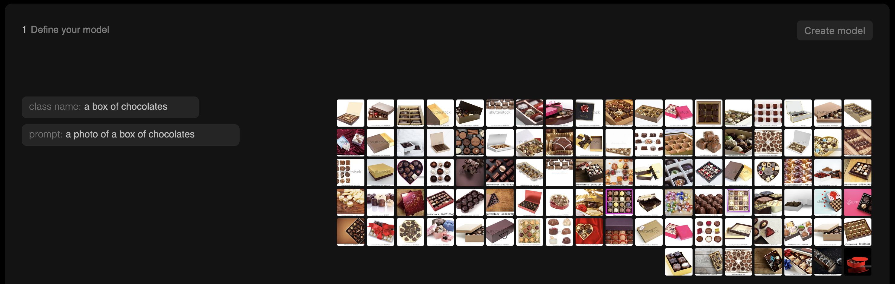
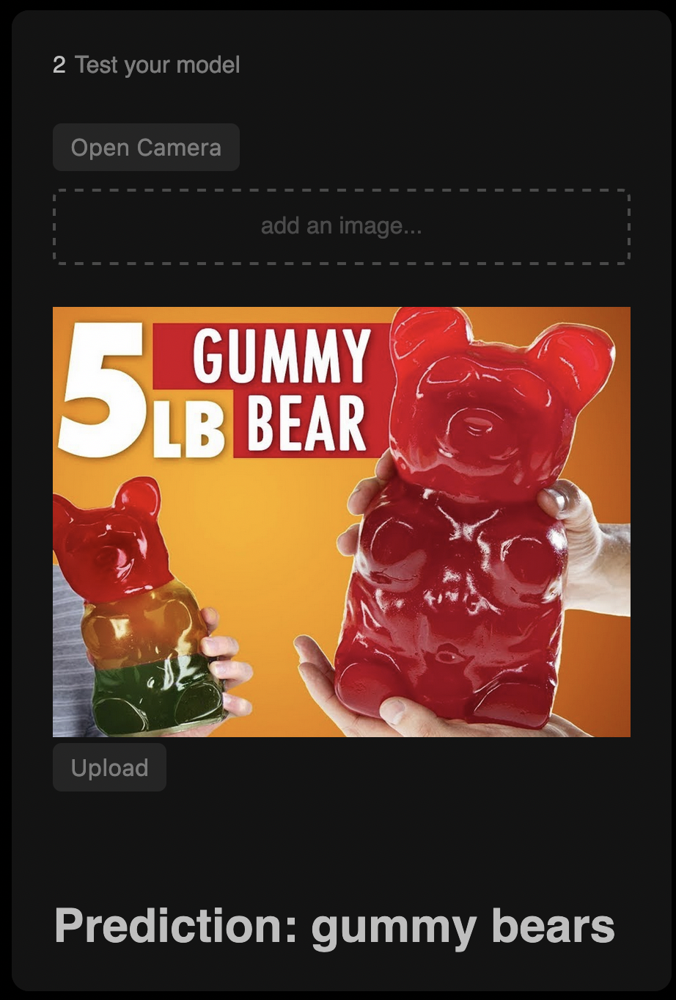

# Getting Started

## What is an image classifier?

An image classifier is an AI tool that can distinguish between different things in a photo or image. For example, maybe you need to determine if there's a person in an image or if it's an animal. Or maybe you need to distinguish between various types of food. If you can describe your different categories (we call them classes) with words, you can probably create a classifier to tell them apart.

## What is zeroshot?

Zeroshot is a the easiest way to create a computer vision classifier. With Zeroshot, you describe what you are looking for in text and photos, and we'll generate a classifier you can use in any of our client libraries.

## Usage

To get started, visit [usezeroshot.com](https://www.usezeroshot.com).

1. Define your classes, or the different categories you want to tell apart. You can do this by describing what you're looking for in text.

2. When you enter a class description, we will show you examples of images we will use to train your model. If you're not getting what you're looking for, try a more specific description in the "prompt" section. See [prompting tips](docs/prompting_tips.md) for more advice.

1. Once you've entered your classes, hit "Create Model". We'll show you how you can use this classifier in our libraries, or you can upload your own image to test the model.

